# 基于 VirtualBox 的网络攻防基础环境搭建

## 实验目的

* 掌握 VirtualBox 虚拟机的安装与使用；
* 掌握 VirtualBox 的虚拟网络类型和按需配置；
* 掌握 VirtualBox 的虚拟硬盘多重加载；

## 实验环境

以下是本次实验需要使用的网络节点说明和主要软件举例：

* VirtualBox 虚拟机
* 攻击者主机（Attacker）：Kali Rolling
* 网关（Gateway, GW）：Debian 
* 靶机（Victim）：Kali / Windows XP

## 实验要求

* 虚拟硬盘配置成多重加载；
* 搭建满足如下拓扑图所示的虚拟机网络拓扑

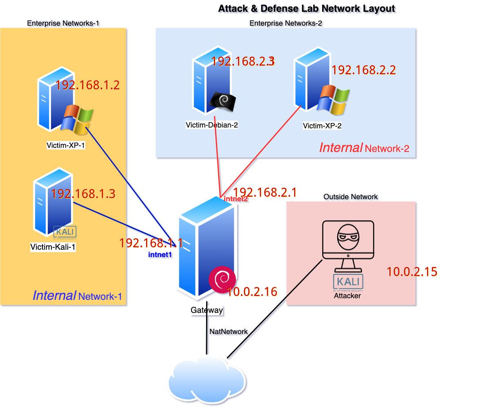

* 完成以下网络连通性测试；
    - [x] 靶机可以直接访问攻击者主机
    - [x] 攻击者主机无法直接访问靶机
    - [x] 网关可以直接访问攻击者主机和靶机
    - [x] 靶机的所有对外上下行流量必须经过网关
    - [x] 所有节点均可以访问互联网 
## 实验过程
* 配置 ssh 方便操作
  * 新建 ssh 端口转发
  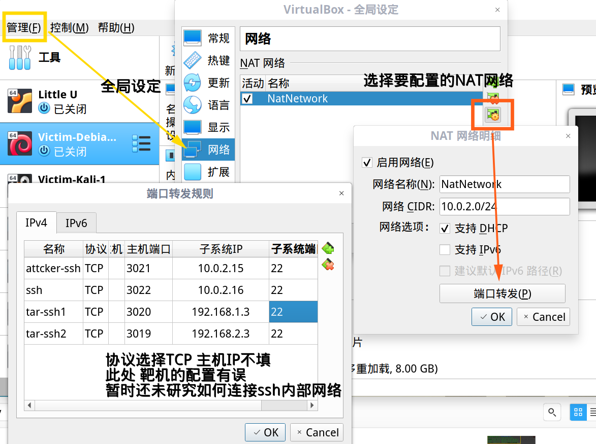
  * 客户端配置 [ 以 gateway 为例 ] [ 黄字部分为需要修改成的 ]
   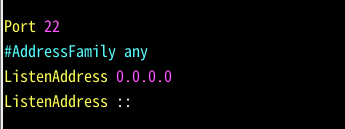
   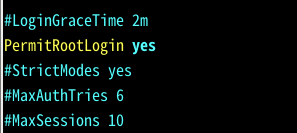
   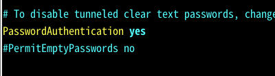
  * ``` service ssh restart``` 重启 ssh 服务
  * ```ssh root@127.0.0.1 -p 3022``` 主机连接
* 虚拟硬盘多重加载
  * 不要在释放之前生成快照！
* 网络拓扑搭建
  * 组成
    * 内部网络 「intnet1」 192.168.1.0/24
    * 内部网络 「intnet2」 192.168.2.0/24
    * NAT网络 「NatNetwork」 10.0.2.0/24
* 以gateway为例的结果
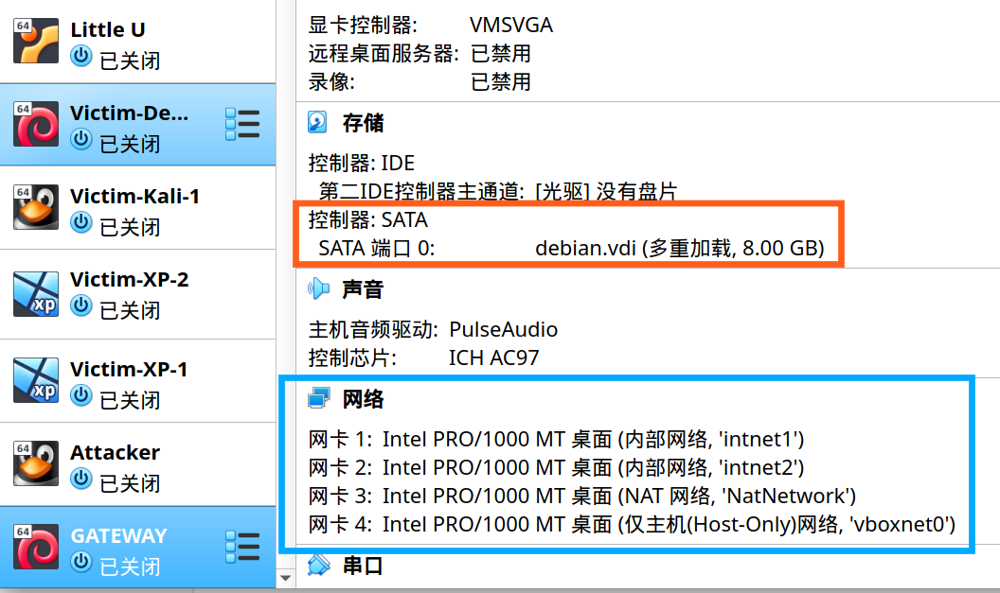
* 网络连通性测试 [ 由于宿主机性能原因，两内部网络以Kali，Debian为例 ]
  * 各网络原配置情况
    * gateway
  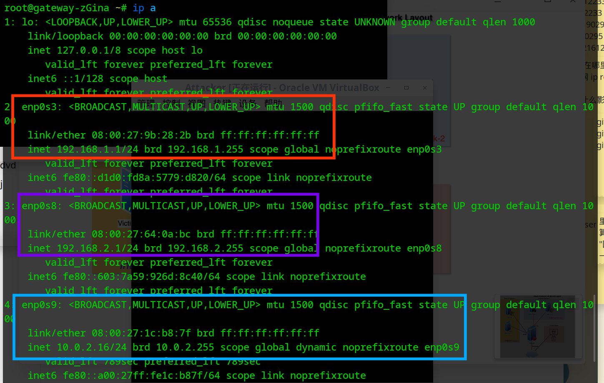
    * Attacker 
    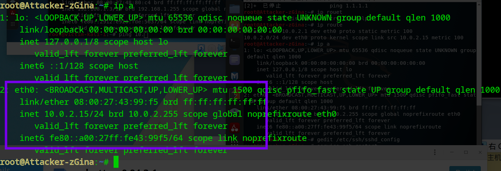
  * 修改配置实现目标网络  
    * 两内部网络的网关设置为```10.0.2.16``` 
      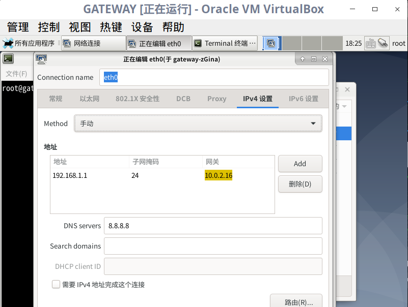 
    * 配置 gateway iptables
      * 首先开启ipv4端口转发功能
     ```sysctl net.ipv4.ip_forward=1```
     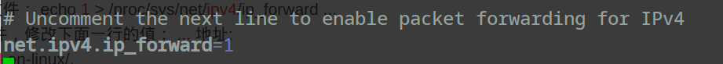
      * 将下列规则添加到iptables中
        >iptables -t nat -A POSTROUTING -o eth0 -s 192.168.1.0/24 -j MASQUERADE   
       iptables -t nat -A POSTROUTING -o eth0 -s 192.168.1.0/24 -j MASQUERADE
      * 实现结果如图
     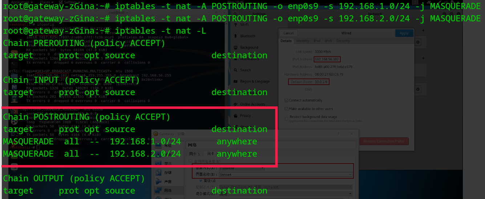
  * 连通性测试
    * Target可以直接访问Internet和Attacker
    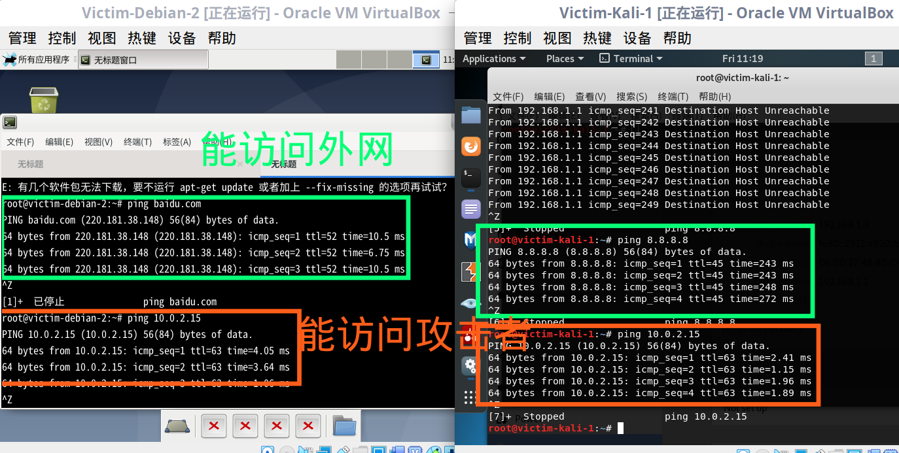
    * Attacker无法直接访问Target，可以访问Internet,gateway
    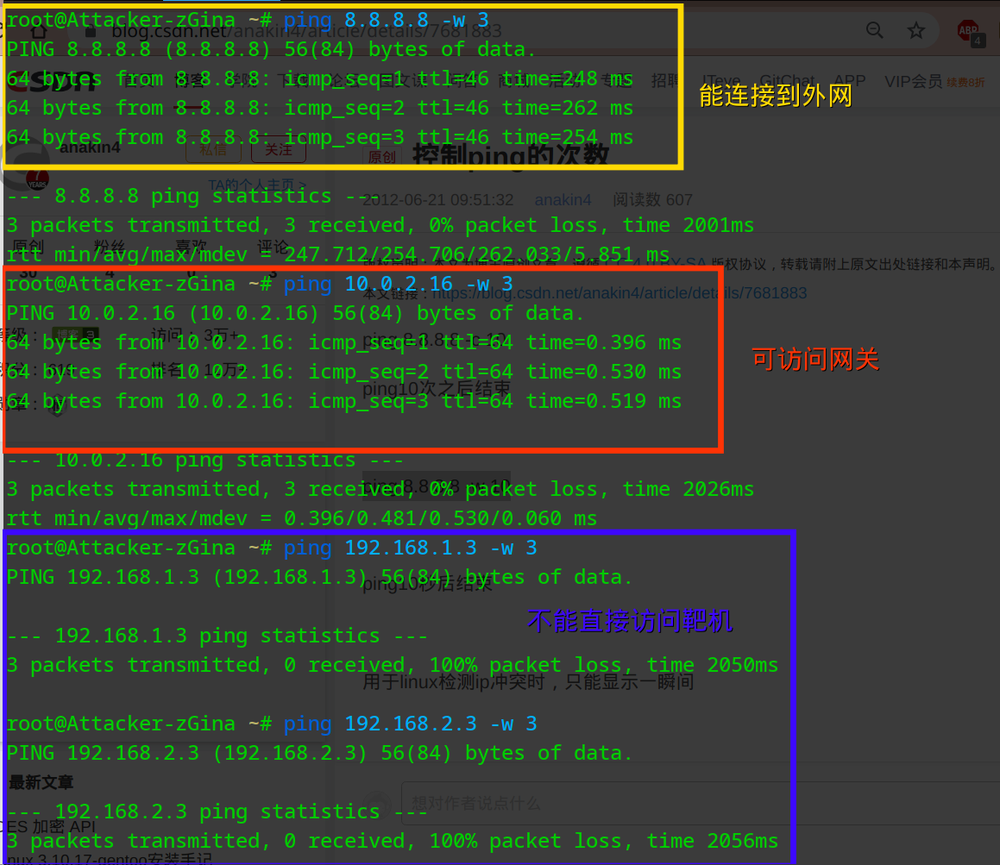
    * gateway可访问Target，Attacker，Internet
    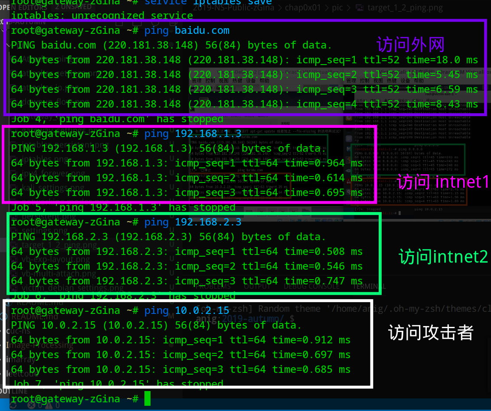
    * Target的所有对外上下行流量经过gateway [以victim-kali-1为例]
    此处要屏蔽掉ssh的流量
    ```tcpdump -i enp0s9 '((dst host !10.0.2.2) and (src host !10.0.2.2))'```

    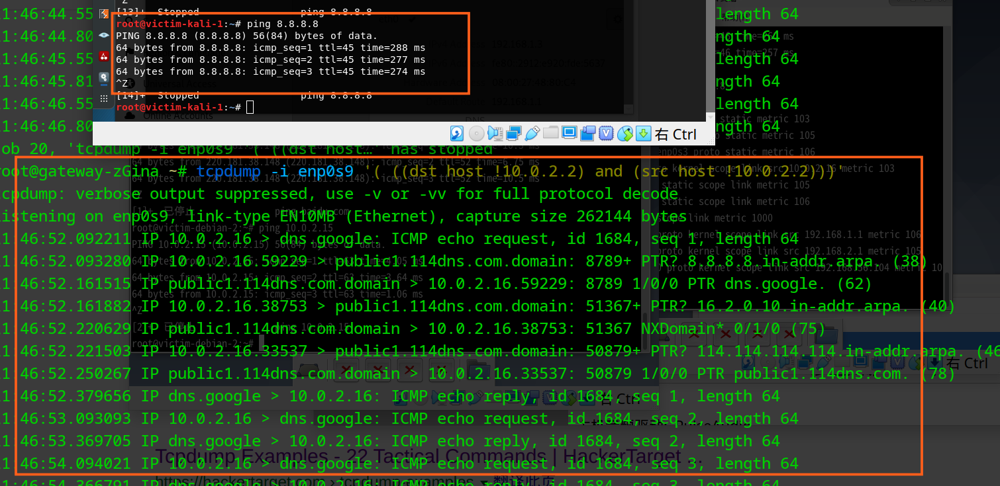
    将gateway第三块网卡（enp0s9）关闭后发现 Target 无法连通Internet
    
## 疑惑&后续待解决问题
* NAT Network 中的网关在哪里,如何监测其上下行流量？
  * 此为Virtualbox内带，黑盒，无法监测
* 网卡的路由设置有什么作用，会造成什么影响？
  * 如图在IPv4设置中右下角的‘路由’项，添加条目后可以完成什么功能
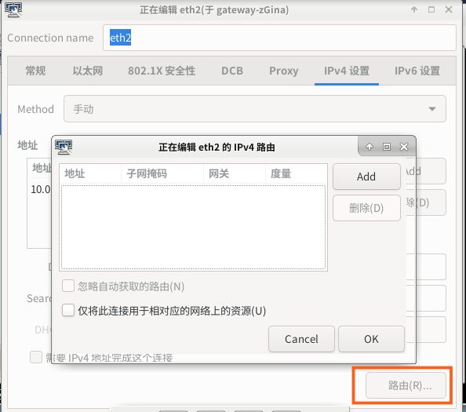 
* 内部网络主机的ssh配置
  * 为其添加 host-only 网络？
* 为何多张网卡均设置网关（没有配置iptables端口转发）即无法连通Internet，即使他们的网关ip地址是一样的（即eth0、eth1的网关地址均配置为10.0.2.1）?

## 参考

 *  [2018-NS-Public-jckling](https://github.com/CUCCS/2018-NS-Public-jckling/blob/master/ns-0x01/%E5%9F%BA%E4%BA%8EVirtualBox%E7%9A%84%E7%BD%91%E7%BB%9C%E6%94%BB%E9%98%B2%E5%9F%BA%E7%A1%80%E7%8E%AF%E5%A2%83%E6%90%AD%E5%BB%BA.md)

  * [virtualbox-networking-explained](https://technology.amis.nl/2018/07/27/virtualbox-networking-explained/#prettyPhoto) 
* [how-to-ssh-to-a-virtualbox-guest](https://stackoverflow.com/questions/5906441/how-to-ssh-to-a-virtualbox-guest-externally-through-a-host)