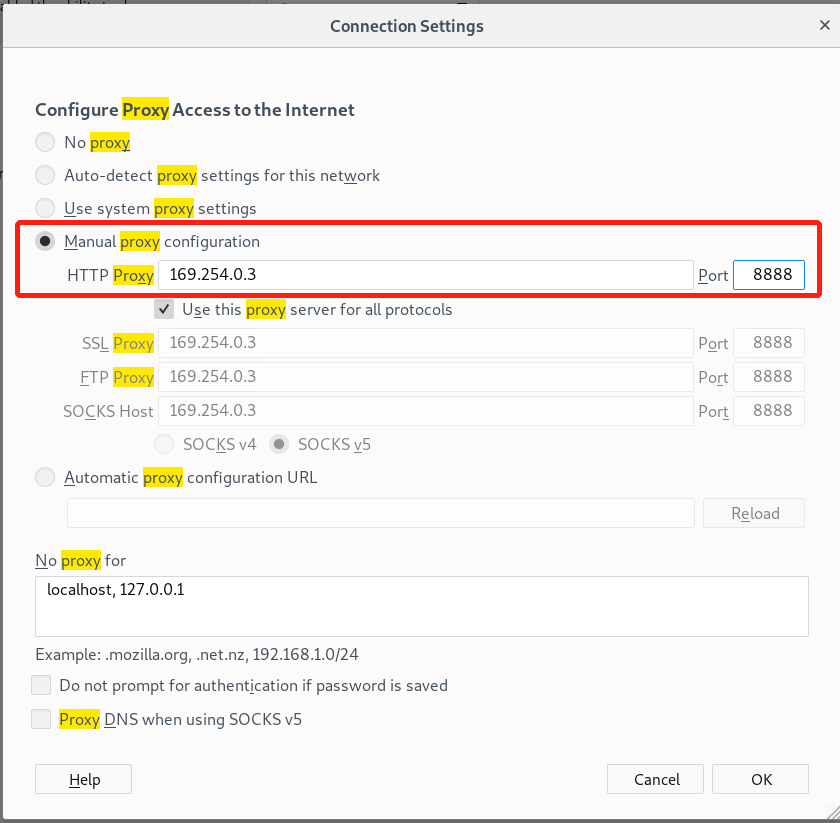
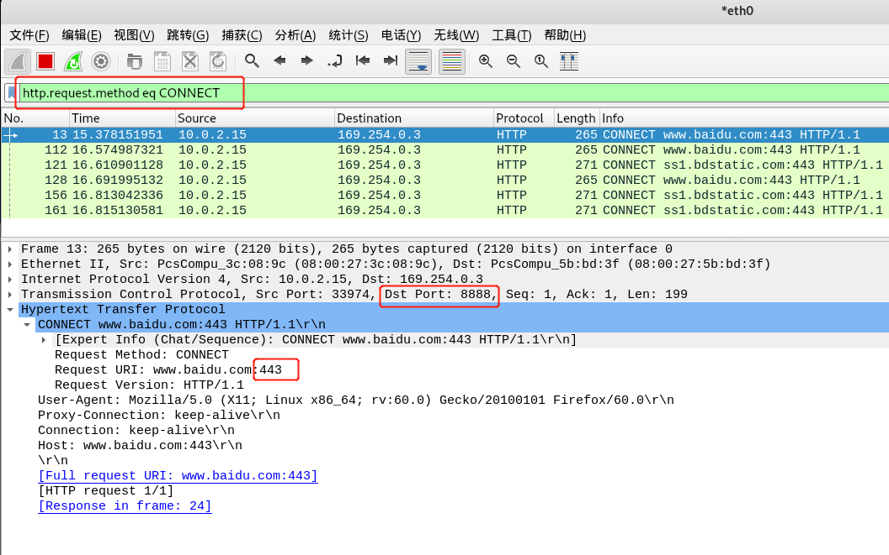
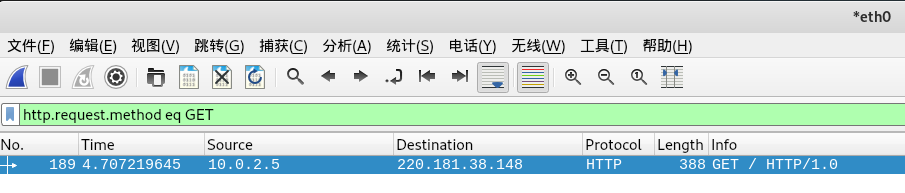
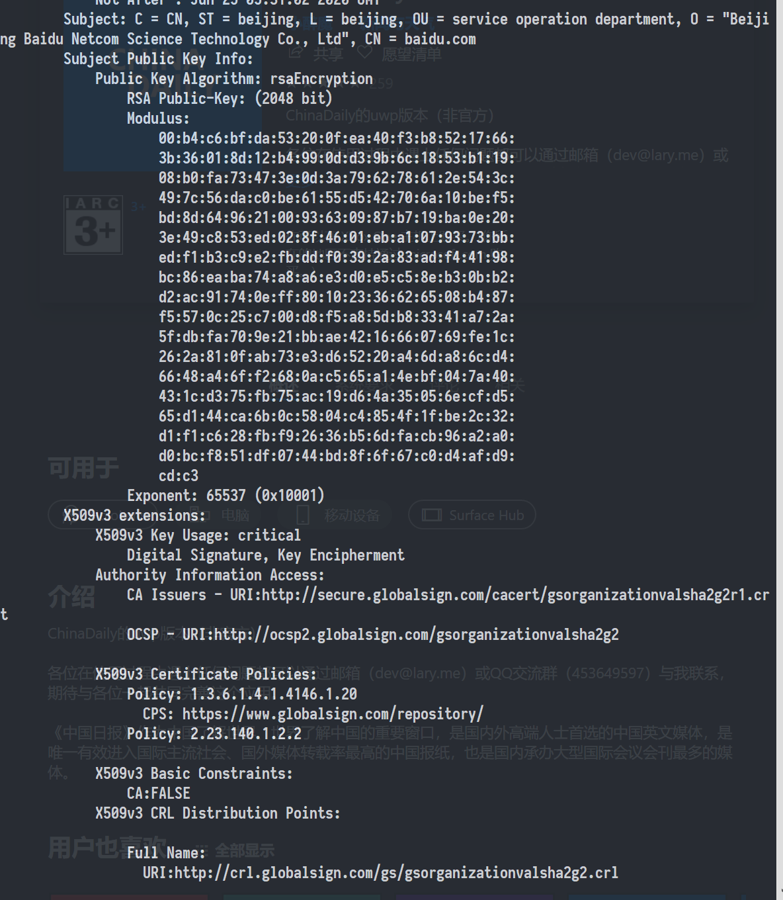
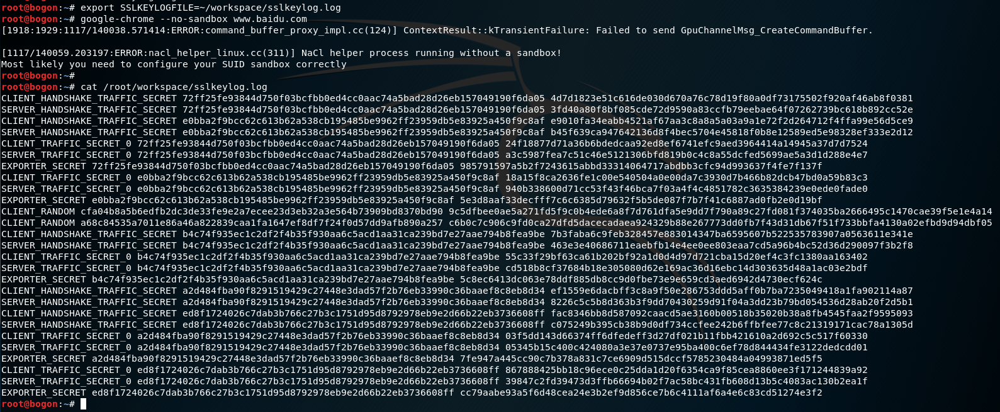
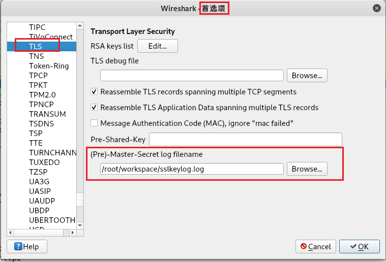
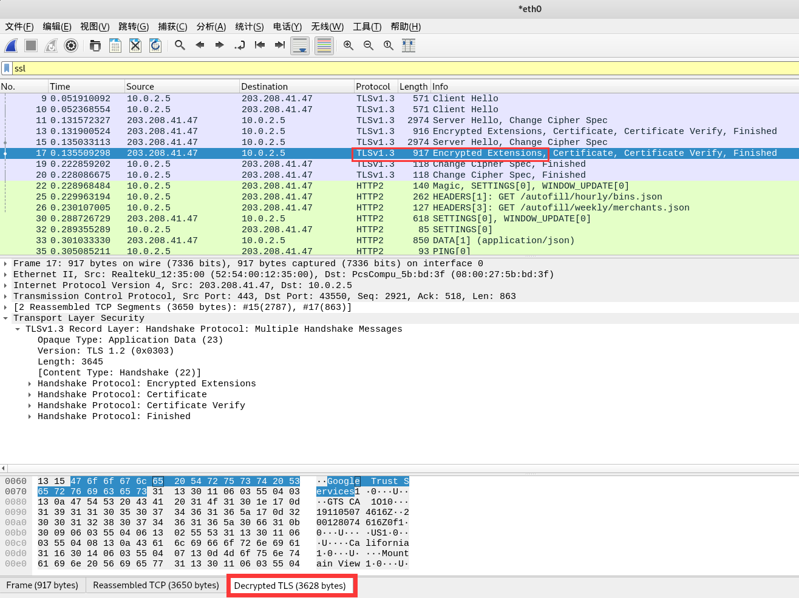

# HTTP代理服务器实验

# 实验目的

在Kali Linux中安装tinyproxy，然后用主机设置浏览器代理指向tinyproxy建立的HTTP正向代理，在Kali中用wireshark抓包，分析抓包过程，理解HTTP正向代理HTTPS流量的特点。

# 实验环境

配置完成拓扑环境的`kali-attacke`以及`kali-victim`两台主机

**tinyproxy**

* 下载：`apt install tinyproxy -y`
* 配置：`vi /etc/tinyproxy/tinyproxy.conf`
  * 配置`Allow IP`

# 实验原理

**代理服务器**


**代理的工作模式**

* **转发代理**
  * 正向代理
  * 绕过审查： 黑名单之外的 IP 地址搭建转发代理服务器 
* **开放代理**
  *  是互联网上人人可访问的转发代理
* **反向代理**
  *  外网发布：特别对于一些官方新闻站点、展示型站点，不需要用户反馈和交互功能，代理服务器可以提供全静态的只读网页服务

**正向代理(前向代理)与反向代理**

>  前向代理作为**客户端的代理**，将从互联网上获取的资源返回给一个或多个的客户端，服务端（如Web服务器）只知道代理的IP地址而不知道客户端的IP地址；而反向代理是作为**服务器端（如Web服务器）代理**使用，而不是客户端。
>
> 客户端借由前向代理可以间接访问很多不同互联网服务器（集群）的资源，而反向代理是供很多客户端都通过它间接访问不同后端服务器上的资源，而不需要知道【常常也不知道】这些后端服务器的存在，而以为所有资源都来自于这个反向代理服务器。 

**HTTP代理**

*  手工配置 -- 自动检测设置 (` WPAD (Web Proxy Auto Discovery) `)

# 实验内容

## 实验：正向代理

**开启端口**

* `kali-attacker`：`\etc\init.d\tinyproxy start`

**配置代理**

* `kali-victim`：`Settings` -> `Configure Proxy Access to theInternet` -> `Manual proxy`

  

**抓包**

* 打开Wireshark进行抓包

**关闭端口**

* `\etc\init.d\tinyproxy stop`

### 实验结果

**查看所有HTTPS代理请求**

<center></center>
**查看所有HTTP GET代理请求**



## 实验：提取pcap包中的SSL证书

* 过滤规则`ssl`，找到SSL会话
*  通过packet list里的info列找到Certificate 
* 导出：`Handshake Protocol: Certificate` --> `Certificates` --> `Certificate` --> ` Export Selected Packet Bytes `

*  使用openssl命令行工具解析DER证书：` openssl x509 -in xxx.der -inform der -text `

### 实验结果



## 实验：解密本地主机HTTPS流量

* 由于Firefox下的Key Log[有坑]( https://developer.mozilla.org/en-US/docs/Mozilla/Projects/NSS/Key_Log_Format )，下载并安装`google-chrome`

  ```shell
  wget https://dl.google.com/linux/direct/google-chrome-stable_current_amd64.deb
  sudo dpkg -i google-chrome-stable_current_amd64.deb
  # apt-get update && apt-get install -f
  ```

* 配置`SSL Key Log`：

  ```shell
  touch sslkeylog.log
  export SSLKEYLOGFILE=~/workspace/sslkeylog.log
  ```

* 开启Wireshark监听

* **在配置完成`SSL Key Log`同一终端中**，用终端打开google

  ```shell
  google-chrome --no-sandbox www.baidu.com
  ```

  

* Wireshark：`首选项` -> `Protocol TLS` -> `(Pre)-Master-Secret log filename`，选择`sslkeylog.log`

  

### 实验结果



* 解密后TLS包出现`Decrypted TLS`

# 常见问题解决

The administrator of this proxy has not configured it to service requests from your host

* 在`/etc/tinyproxy/tinyproxy.conf`中添加`Allow IP`，取消`Allow 10.0.0.0/8`行首注释

Cannot capture SSL/TLS package

* 检查浏览器配置代理时，SSL的配置。在Firefox中，选择`Use this proxy server for all protocols`

# 参考资料

[反向代理 - 维基百科，自由的百科全书]( [https://zh.wikipedia.org/zh-cn/%E5%8F%8D%E5%90%91%E4%BB%A3%E7%90%86](https://zh.wikipedia.org/zh-cn/反向代理) )

[ How to install Google Chrome on Kali Linux and fix the errors ]( https://geekviews.tech/how-to-install-google-chrome-on-kali-linux/ )