#  基于 Scapy 编写端口扫描器

# 实验目的

掌握网络扫描之端口状态探测的基本原理

# 实验环境

* scapy

* nmap

* virtualbox**内网**拓扑：

  

# 实验原理

**原理：基于TCP三次握手**

**开放扫描**

> 开放扫描，会产生大量审计数据，容易被对方发现，但其可靠性较高；

* TCP connect scan
  * 攻击者发送`SYN+PORT`
    * 若服务器（受害者主机）返回`SYN+ACK`，说明该端口`OPEN`
    * 若服务器返回`RST+ACK`，说明该端口`CLOSED`
    * 若服务器无反应，则说明该端口`FILTERED`
*  UDP scan
  * 发送`packet+PORT`
    * 超时无响应，说明是`OPEN/FILTERED`
    * 返回`ICMP ERROR(Type3, Code 3)`，说明是`OPEN`
    * 返回`ICMP ERROR(Type3,Code 1,2,9,10,13)`，说明是`FILTERED`

**半开放扫描**

可靠性不如开放扫描，但隐蔽性得到提升

* TCP XMAS/FIN/NULL scan
  * 发送`Flags(PSH,FIN,URG)/Flags(FIN)/No Flags + PORT`
    * 超时无响应，说明是`OPEN`
    * 返回`RST+ACK`，说明`CLOSED`
    * 返回`ICMP ERROR(Type3,Code 1,2,3,9,10,13)`，说明`FILTERED`
*  TCP stealth scan
  *  This technique is used to avoid port scanning detection by firewalls 
  * 发送`SYN+PORT`
    * 返回`SYN+ACK`，说明`OPEN`
    * 返回`RST+ACK`，说明`CLOSED`
    * 超时无响应，或返回`ICMP ERROR(Type3,Code 1,2,3,9,10,13)`，说明`FILTERED`

# 实验内容

## 预备

在`kali-victim`中安装`ufw`，用于**控制端口打开、关闭以及过滤**：`sudo apt install ufw`

* 开启端口：`sudo ufw enable && ufw allow portno/tcp(udp) && nc -lvp(-lup) portno`
  * 防火墙开启某一端口，并用`netcat`主动监听
  * `ufw status verbose`查看状态
* 过滤端口：`sudo ufw enable && ufw deny portno/tcp(udp)`
  * `ufw deny`设置过滤，可以进一步根据ip地址进行过滤
* 关闭端口：`sudo ufw disable`
  * 关闭`ufw`，相当于关闭端口

本实验以端口`8083/tcp(udp)`为实验端口

## scapy实验

**TCP connect scan**

```python
#! /usr/bin/python

from scapy.all import *

dst_ip = "172.16.111.138"
src_port = RandShort()
dst_port=8083

tcp_connect_scan_resp = sr1(IP(dst=dst_ip)/TCP(sport=src_port,dport=dst_port,flags="S"),timeout=10)
if(str(type(tcp_connect_scan_resp))=="<type 'NoneType'>"):
	print "Filtered"
elif(tcp_connect_scan_resp.haslayer(TCP)):
	if(tcp_connect_scan_resp.getlayer(TCP).flags == 0x12):
		send_rst = sr(IP(dst=dst_ip)/TCP(sport=src_port,dport=dst_port,flags="AR"),timeout=10)
		print "Open"
	elif (tcp_connect_scan_resp.getlayer(TCP).flags == 0x14):
		print "Closed"
```

* Closed

  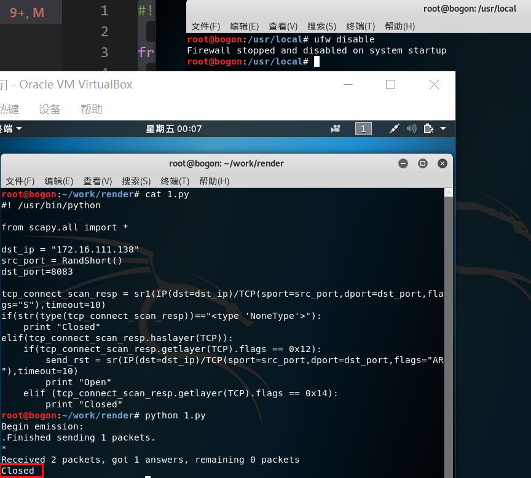

* Filtered

  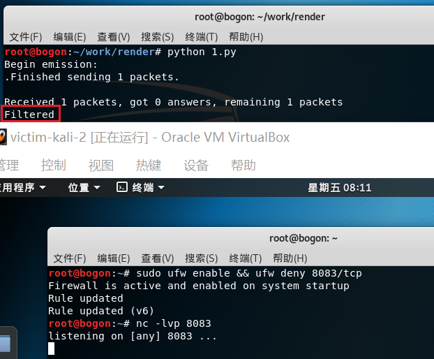

* Open

  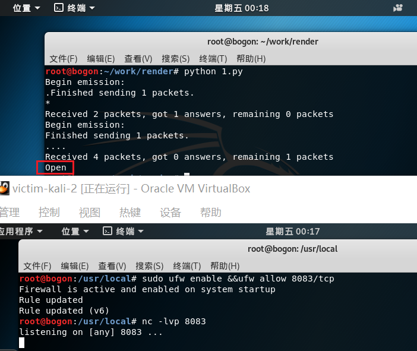

* 抓包结果并分析与课本中的扫描方法原理相符

**TCP stealth scan**

```python
#! /usr/bin/python

from scapy.all import *

dst_ip = "172.16.111.138"
src_port = RandShort()
dst_port = 8083

stealth_scan_resp = sr1(
    IP(dst=dst_ip)/TCP(sport=src_port, dport=dst_port, flags="S"), timeout=10)
if(str(type(stealth_scan_resp)) == "<type 'NoneType'>"):
    print "Filtered"
elif(stealth_scan_resp.haslayer(TCP)):
    if(stealth_scan_resp.getlayer(TCP).flags == 0x12):
        send_rst = sr(IP(dst=dst_ip)/TCP(sport=src_port,
                                 dport=dst_port, flags="R"), timeout=10)
        print "Open"
    elif (stealth_scan_resp.getlayer(TCP).flags == 0x14):
        print "Closed"
elif(stealth_scan_resp.haslayer(ICMP)):
    if(int(stealth_scan_resp.getlayer(ICMP).type) == 3 and int(stealth_scan_resp.getlayer(ICMP).code) in [1, 2, 3, 9, 10, 13]):
        print "Filtered"
```

* Closed

  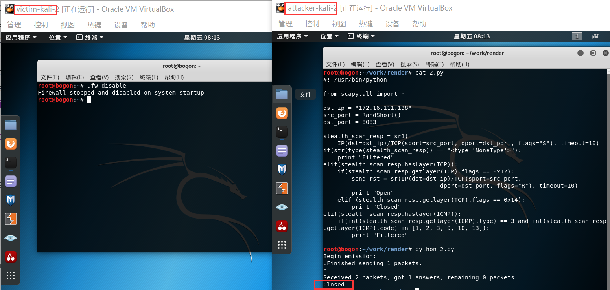

* Filtered

  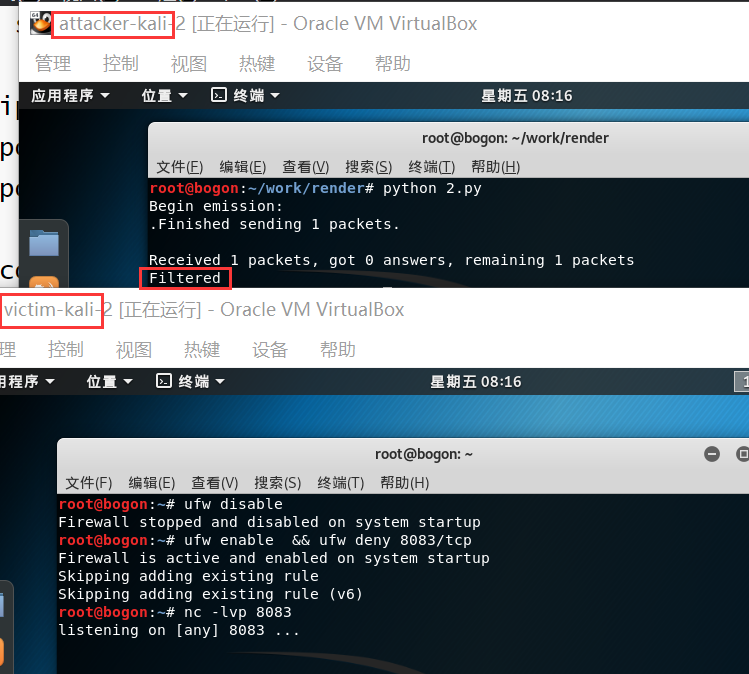

* Open

  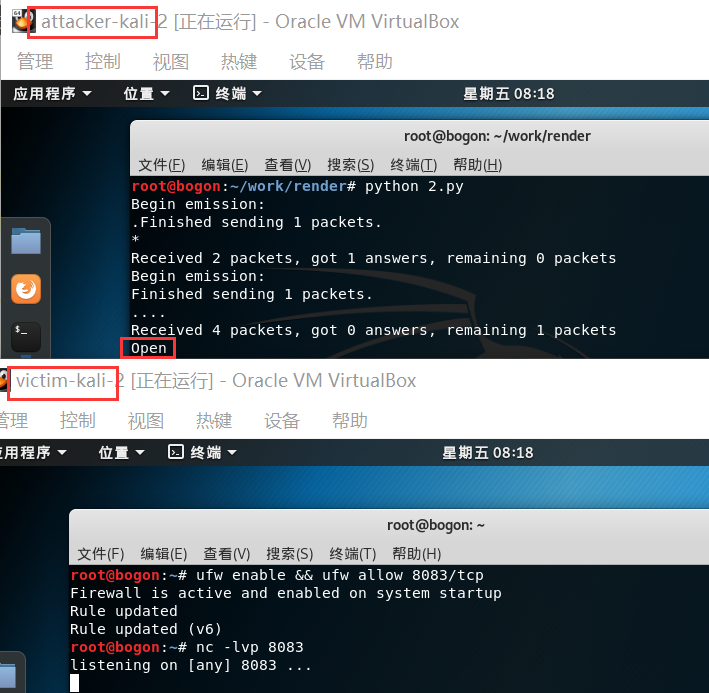

* 抓包结果并分析与课本中的扫描方法原理相符

**TCP Xmas scan**

```python
#! /usr/bin/python

from scapy.all import *

dst_ip = "172.16.111.138"
src_port = RandShort()
dst_port = 8083

xmas_scan_resp = sr1(
    IP(dst=dst_ip)/TCP(dport=dst_port, flags="FPU"), timeout=10)
if (str(type(xmas_scan_resp)) == "<type 'NoneType'>"):
    print "Open|Filtered"
elif(xmas_scan_resp.haslayer(TCP)):
    if(xmas_scan_resp.getlayer(TCP).flags == 0x14):
        print "Closed"
elif(xmas_scan_resp.haslayer(ICMP)):
    if(int(xmas_scan_resp.getlayer(ICMP).type) == 3 and int(xmas_scan_resp.getlayer(ICMP).code) in [1, 2, 3, 9, 10, 13]):
        print "Filtered"
```

* Closed

  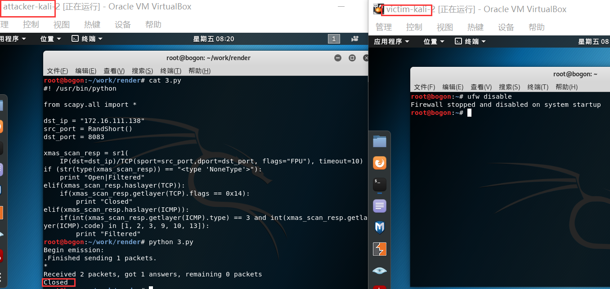

* Filtered

  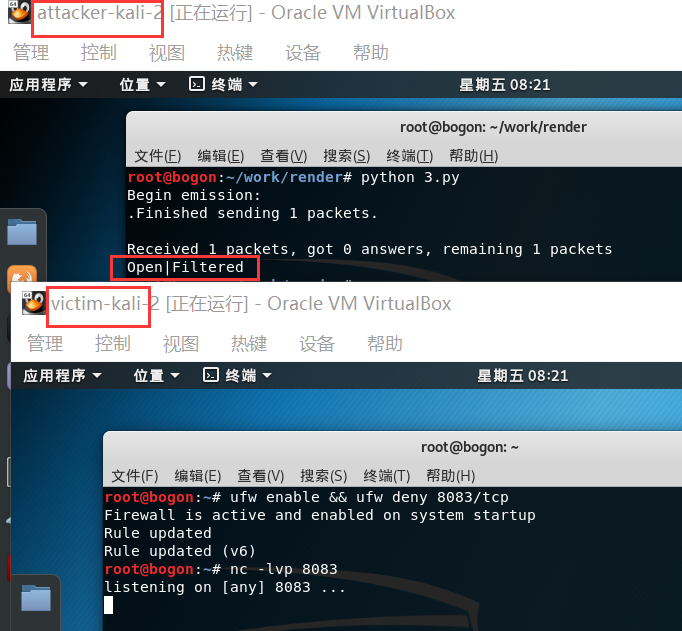

* Open

  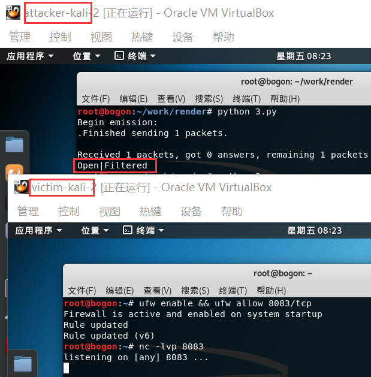

* 抓包结果并分析与课本中的扫描方法原理相符

**TCP fin scan**

```python
#! /usr/bin/python

from scapy.all import *

dst_ip = "172.16.111.138"
src_port = RandShort()
dst_port = 8083

fin_scan_resp = sr1(IP(dst=dst_ip)/TCP(dport=dst_port, flags="F"), timeout=10)
if (str(type(fin_scan_resp)) == "<type 'NoneType'>"):
    print "Open|Filtered"
elif(fin_scan_resp.haslayer(TCP)):
    if(fin_scan_resp.getlayer(TCP).flags == 0x14):
        print "Closed"
elif(fin_scan_resp.haslayer(ICMP)):
    if(int(fin_scan_resp.getlayer(ICMP).type) == 3 and int(fin_scan_resp.getlayer(ICMP).code) in [1, 2, 3, 9, 10, 13]):
        print "Filtered"
```

* Closed

  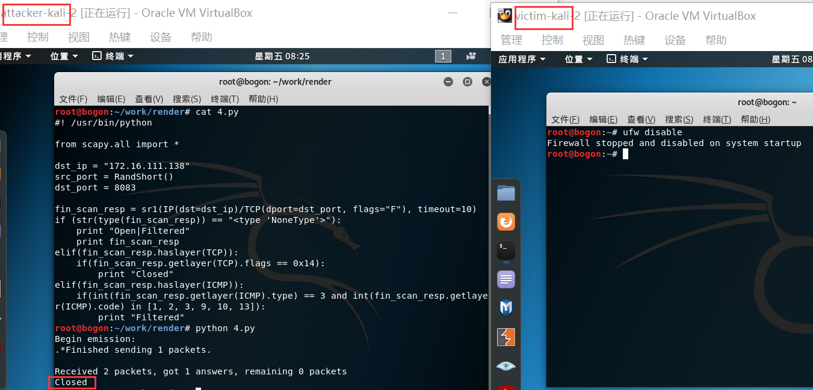

* Filtered

  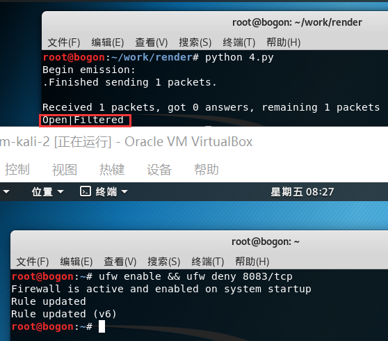

* Open

  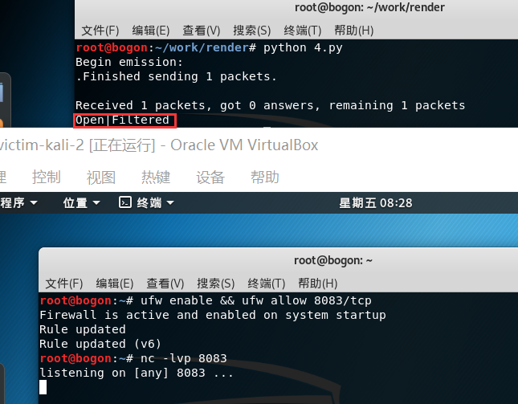

* 抓包结果并分析与课本中的扫描方法原理相符

**TCP null scan**

```python
#! /usr/bin/python

from scapy.all import *

dst_ip = "172.16.111.138"
src_port = RandShort()
dst_port=8083

null_scan_resp = sr1(IP(dst=dst_ip)/TCP(dport=dst_port,flags=""),timeout=10)
if (str(type(null_scan_resp))=="<type 'NoneType'>"):
    print "Open|Filtered"
elif(null_scan_resp.haslayer(TCP)):
    if(null_scan_resp.getlayer(TCP).flags == 0x14):
        print "Closed"
elif(null_scan_resp.haslayer(ICMP)):
    if(int(null_scan_resp.getlayer(ICMP).type)==3 and int(null_scan_resp.getlayer(ICMP).code) in [1,2,3,9,10,13]):
        print "Filtered"
```

* Closed

  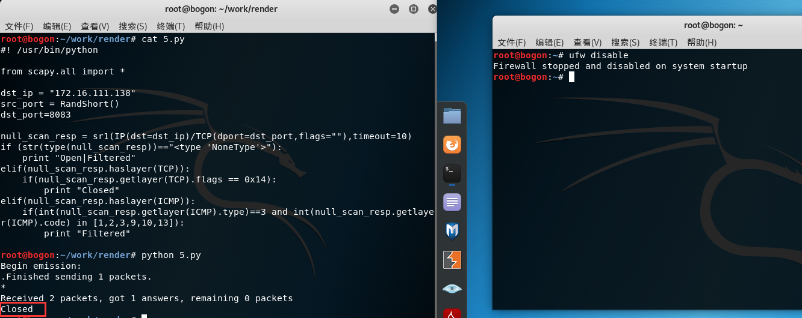

* Filtered

  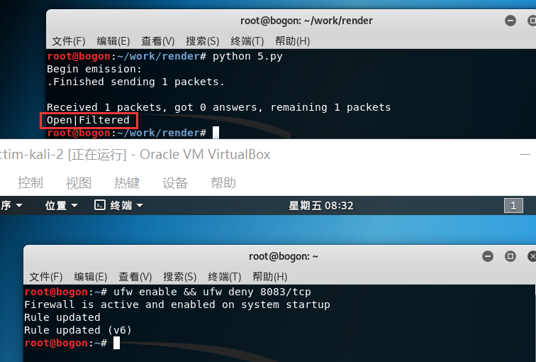

* Open

  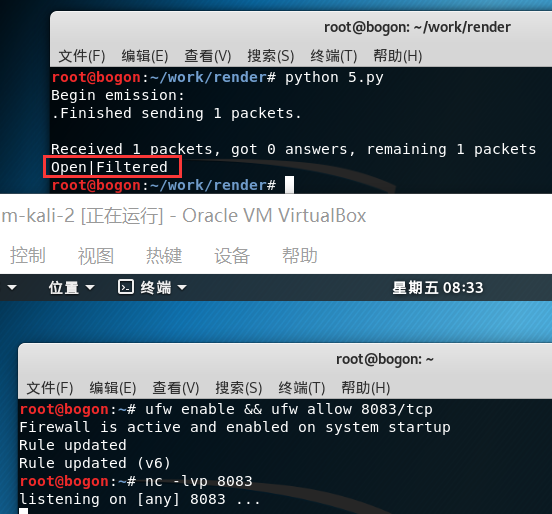

* 抓包结果并分析与课本中的扫描方法原理相符

**UDP scan**

```python
#! /usr/bin/python

from scapy.all import *

dst_ip = "172.16.111.138"
src_port = RandShort()
dst_port=8083
dst_timeout=10

def udp_scan(dst_ip,dst_port,dst_timeout):
    udp_scan_resp = sr1(IP(dst=dst_ip)/UDP(dport=dst_port),timeout=dst_timeout)
    if (str(type(udp_scan_resp))=="<type 'NoneType'>"):
        retrans = []
        for count in range(0,3):
            retrans.append(sr1(IP(dst=dst_ip)/UDP(dport=dst_port),timeout=dst_timeout))
        for item in retrans:
            if (str(type(item))!="<type 'NoneType'>"):
                udp_scan(dst_ip,dst_port,dst_timeout)
        return "Open|Filtered"
    elif (udp_scan_resp.haslayer(UDP)):
        return "Open"
    elif(udp_scan_resp.haslayer(ICMP)):
        if(int(udp_scan_resp.getlayer(ICMP).type)==3 and int(udp_scan_resp.getlayer(ICMP).code)==3):
            return "Closed"
        elif(int(udp_scan_resp.getlayer(ICMP).type)==3 and int(udp_scan_resp.getlayer(ICMP).code) in [1,2,9,10,13]):
            return "Filtered"

x=udp_scan(dst_ip,dst_port,dst_timeout)
print x
```

**删除已有规则：**`sudo ufw delect allow 8083/tcp (sudo ufw reset)`

**检查udp端口配置是否成功：**`sudo iptables -L -n -v | grep 8083`

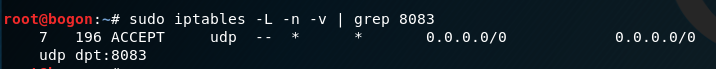
* Closed

  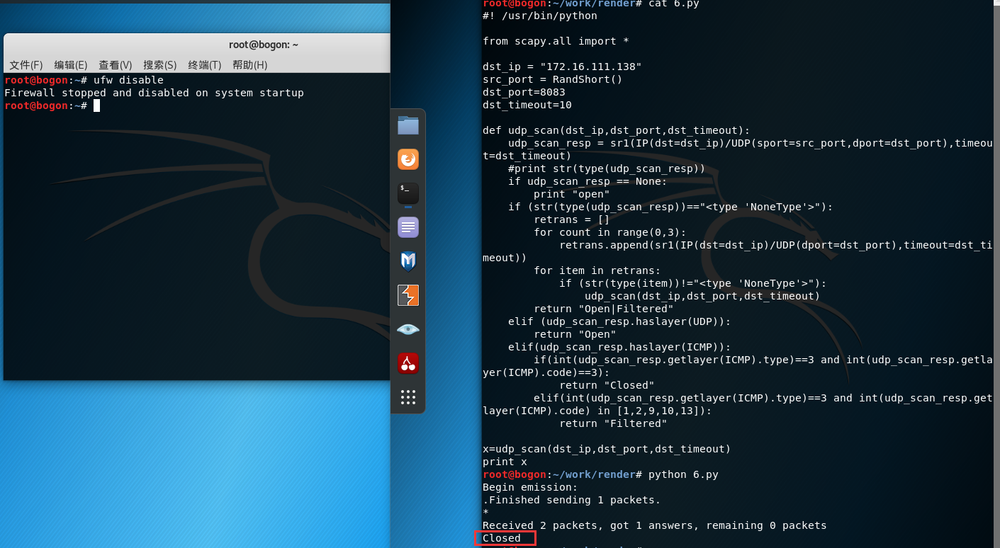

* Filtered

  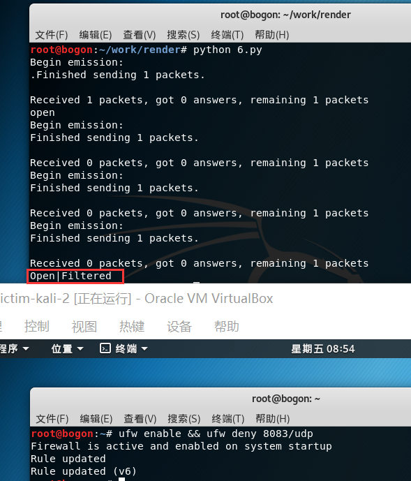

* Open

  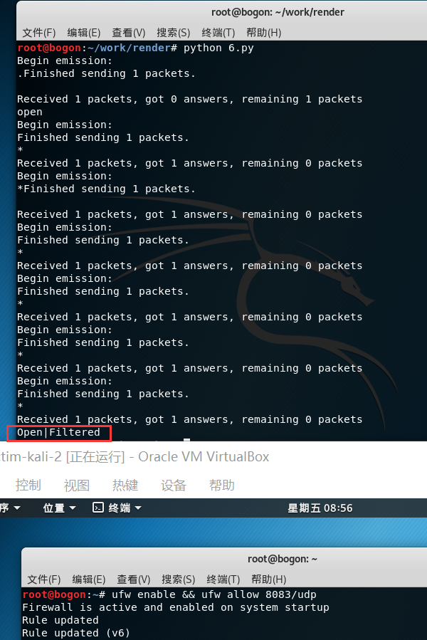


* 抓包结果并分析与课本中的扫描方法原理相符

## nmap实验

>  Nmap 是 network mapper 的简称，是一款开源的工具，能够快速的扫描大范围的设备并且能提供大量关于网络设备的有价值信息，他可以用来进行 IT 审计和网络相关的安全分析。 

| **TCP connect scan** | `nmap -sT ip` |
| -------------------- | ------------- |
| **TCP stealth scan** | `nmap -sS ip` |
| **TCP Xmas scan**    | `nmap -sX ip` |
| **TCP FIN scan**     | `nmap -sF ip` |
| **TCP NULL scan**    | `nmap -sN ip` |
| **UDP scan**         | `nmap -sU ip` |

以**TCP stealth scan**为例

* Closed

  * 不指定端口：被隐藏在Not shown

    

  * 显示指定端口

    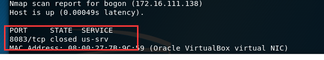

* Filtered

  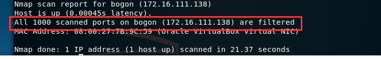

* Open

  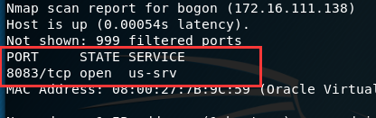

# 参考资料

[ Port Scanning using Scapy ]( https://resources.infosecinstitute.com/port-scanning-using-scapy/#gref )

[ How to open DNS port 53 using ufw on Ubuntu/Debian Linux - nixCraft ]( https://www.cyberciti.biz/faq/howto-open-dns-port-53-using-ufw-ubuntu-debian/ )

[ TCP FIN, NULL, and Xmas Scans (-sF, -sN, -sX) | Nmap Network Scanning ]( https://nmap.org/book/scan-methods-null-fin-xmas-scan.html )